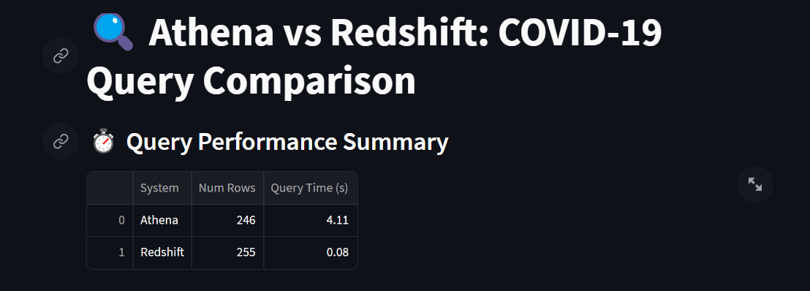
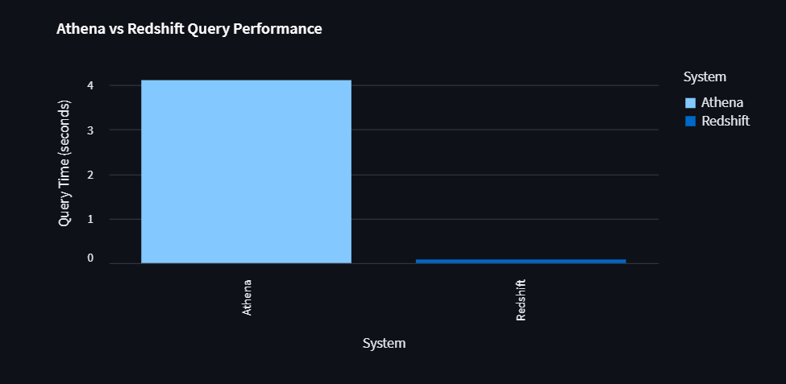
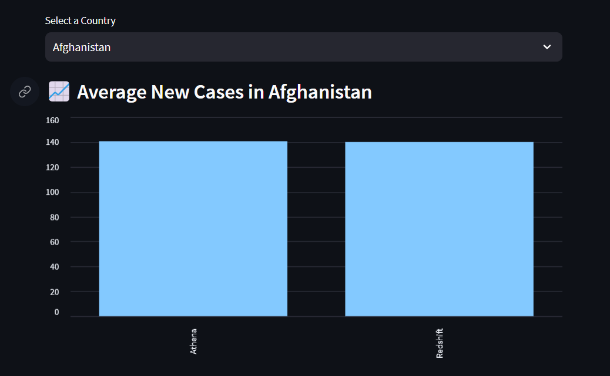

# 💾 Data Lake vs Data Warehouse: A Cloud Analytics Comparison (Athena vs Redshift)

This project compares the performance, cost, and flexibility of querying COVID-19 data using a **Data Lake (AWS Athena)** vs a **Data Warehouse (Amazon Redshift)**.

## 📦 Tech Stack

- AWS Athena (Data Lake)
- AWS Glue
- Amazon Redshift (Data Warehouse)
- S3 for raw & processed data
- Python (pandas, boto3, psycopg2, pyspark)
- Streamlit dashboard
- SQL

<!-- ## 📊 What’s Compared?

| Metric              | Athena (Data Lake)       | Redshift (Data Warehouse)       |
|---------------------|--------------------------|----------------------------------|
| Query Performance   | ✅ Measured in seconds    | ✅ Measured in seconds           |
| Cost per Query      | ✅ Estimated from data scanned | ✅ Flat cost (per hour)    |
| Schema Flexibility  | ✅ Schema-on-read         | ❌ Schema-on-write               |
| Data Freshness      | ✅ Always up to date      | ❌ Manual loading required       | -->

## 📂 Folder Structure

data-lake-vs-warehouse/
│
├── data_lake/
│   ├── ingestion/
│   │   └── ingest_raw_data.py
│   ├── processing/
│   │   └── transform_with_spark.py
│   ├── querying/
│       └── query.py
├── data_warehouse/
│   ├── schema/
│   │   └── schema.sql
│   ├── etl/
│       └── load_s3_data.py
│
├── comparison_notebooks/
│   ├── performance_comparison.py
│
├── dashboard/
│   └── dashboard.py
│
│
└── requirements.txt

## 🚀 Getting Started

```bash
pip install -r requirements.txt
python -m streamlit run dashboard/dashboard.py
```

## 🧠 Insights

- Athena offers more flexibility and lower upfront cost.

- Redshift gives better performance on large queries, once data is loaded.

## 📊 Athena vs Redshift: Cloud Analytics Comparison

| Feature              | **AWS Athena (Data Lake)**                                  | **Amazon Redshift (Data Warehouse)**                      |
|----------------------|-------------------------------------------------------------|-----------------------------------------------------------|
| **Query Time (s)**   | ~4.11                                                       | ~0.08                                                     |
| **Cost per Query ($)** | ~$0.002 (pay per TB scanned)                               | ~$0.0005 (part of hourly compute)                         |
| **Result Size**      | 246 rows                                                    | 255 rows                                                  |
| **Schema Flexibility** | ✅ Schema-on-Read (highly flexible, tolerant to changes)     | ❌ Schema-on-Write (rigid; needs predefined structure)     |
| **Data Freshness**   | ✅ Always fresh (queries S3 directly)                        | ❌ Requires manual load/update from source                 |
| **Setup Time**       | ⚡ Quick (no cluster setup, use S3 + Glue)                   | 🛠️ Requires provisioning Redshift & loading data           |
| **Best For**         | Ad-hoc analytics, data lake exploration                     | BI dashboards, structured analytics, repeatable queries   |
| **Storage Format**   | Raw files (CSV, Parquet, JSON)                              | Structured relational tables                              |
| **Interoperability** | Easy to integrate with Glue, Spark, ML pipelines            | Works well with BI tools like QuickSight, Tableau         |

## Preview





## 📚 Data Source

[Our World CSV (COVID-19)](https://covid.ourworldindata.org/data/owid-covid-data.csv)

## ✍️ Author

Madhur — building real-world data engineering workflows on AWS.
